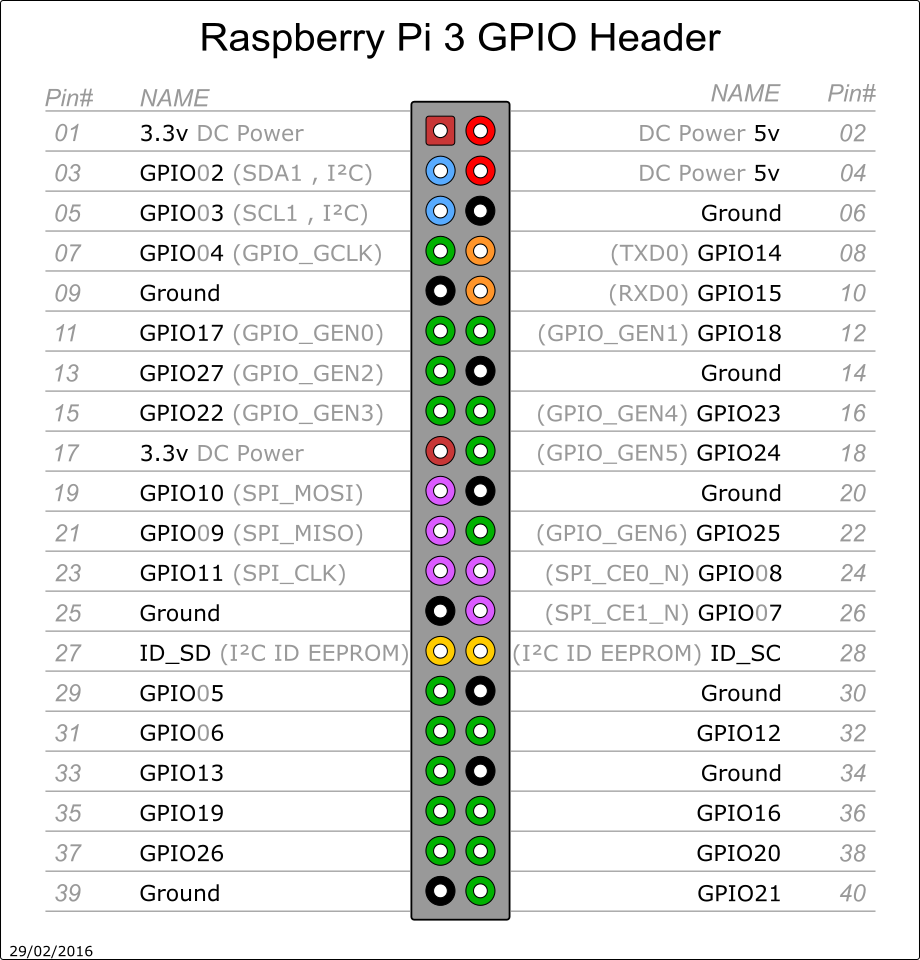

# GPIO




- import to library :books:

```
import RPi.GPIO as GPIO
import time
```

- set to mode :wrench:

```
GPIO.setmode(GPIO.BCM)
or
GPIO.setmode(GPIO.BOARD)
```
> The board revision of the RPi

### Warnings

It is possible that you have more than one script/circuit on the GPIO of your Raspberry Pi. As a result of this, if RPi.GPIO detects that a pin has been configured to something other than the default (input), you get a warning when you try to configure a script. To disable these warnings:

```
GPIO.setwarnings(False)
```

### Setup up a channel
You need to set up every channel you are using as an input or an output. To configure a channel as an input:

```
GPIO.setup(channel, GPIO.IN)
```
To set up a channel as an output:

```
GPIO.setup(channel, GPIO.OUT)
```

### Input
To read the value of a GPIO pin:
```
GPIO.input(channel)
```

### Output
To set the output state of a GPIO pin:
```
GPIO.output(channel, state)
```

### Cleanup
At the end any program, it is good practice to clean up any resources you might have used. This is no different with RPi.GPIO. By returning all channels you have used back to inputs with no pull up/down, you can avoid accidental damage to your RPi by shorting out the pins. Note that this will only clean up GPIO channels that your script has used. Note that GPIO.cleanup() also clears the pin numbering system in use.

To clean up at the end of your script:
```
GPIO.cleanup()
```

:pencil2: Source : [SourceForge](https://sourceforge.net/p/raspberry-gpio-python/wiki/BasicUsage/)
---
